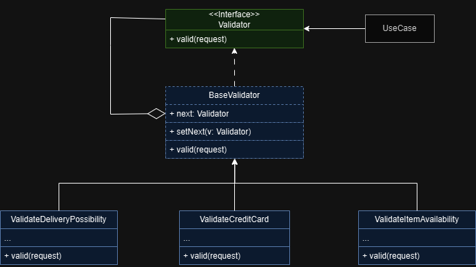

# Validador de pedidos no carrinho

Neste projeto iremos simular o processamento de validação de um carrinho de compras, ou seja, devemos cuidar
de toda a validação antes da comprar ser concluída como, verificar itens em estoque, verificar possibilidade
de entrega no endereço e por fim verificar pagamento no cartão de crédito, ou seja, se é um cartão válido 
ou não.

# Diagrama do projeto

# Explicação

**1 - Interface:** Aqui declaramos uma interface comum a todos os validadores concretos, nela iremos
declarar o método responsável por validar o que precisamos.

**2 - BaseValidator:** É uma classe opcional, que podemos usar para definir um campo de referência para
o próximo validador da corrente ou até mesmo incluir um método que é comum a todos os validadores. No nosso
exemplo criaremos ele como uma classe que irá armazenar uma referência a interface de 
**Validator** e implementar um método comum a todos os validadores capaz de setar a sequência a corrente 
que chamaremos **setNext()**.

**3 - Validadores concretos:** Classes que irão conter o código real para processar pedidos. Ao receber
o pedido cada classe irá executar a sua validação e caso esteja tudo certo, então passaremos para o próximo
validador da cadeia, caso contrário, iremos estourar uma exceção indicando o erro.

**4 - UseCase:** Está será a nossa classe cliente, ou seja, é onde iremos definir o fluxo de execução da cadeia.

> **Nota:** É importante dizer que as vezes não será preciso utilizar uma classe base, podendo utilizar
> o validador concreto diretamente e definir nele o método para o próximo. Sobre o código cliente
> estamos definindo o fluxo da cadeia, mas tem situações em que podemos definir diretamente nos 
> validadores concretos qual será o próximo da cadeia utilizando a instanciação direta do próximo
> handler. Importante também dizer que temos duas possibilidades para evitar um NullPointerException, 
> a primeira seria definir um handler final que sempre ficará responsável por encerrar a cadeia e a segunda
> seria de antemão definir qual será o ultimo handler e evitar chamar o next, uma vez que ele será nulo.
> O importante é o conceito e a partir disso você deve entender o contexto do seu projeto e ver como ele se encaixa e de qual maneira.