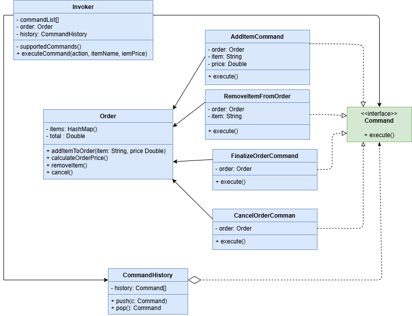

# Cafeteria gourmet

Neste projeto o nosso objetivo será criar um sistema que por comandos irá compor um pedido
do cliente para cafeteria, nele poderemos adicionar itens, remover itens, realizar contagem total do 
pedido, cancelar o pedido inteiro e remover o último comando caso tenha sido feito por engano. 

# Explicação

**1 - Invoker:** Também conhecia como classe invocadora ou remetente, ela fica responsável por iniciar
pedidos, nela deve conter um campo que armazena a referência de um objeto comando ao invés de enviar
o pedido direto ao destinatário. Ela geralmente não fica responsável por criar os comandos deixando
a responsabilidade ao código cliente, mas no nosso exemplo iremos deixar as referências instanciadas
diretamente na classe invocadora.

**2 - Interface Command:** Responsável por declarar um único método comum a todos os comandos que ela
implementa, capaz de executá-los.

**3 - Comandos concretos:** Classes que implementam a interface **Command**, nelas estarão contidas todas
as informações para executar o pedido, mas atenção, um comando concreto não executa a lógica e sim repassa
a responsabilidade para o objeto de destino e nele, sim, será executado a lógica. Comandos concretos apenas
lidam como o pedido chegará ao destinatário.

**4 - Classe Destinatária:** Ela será a classe que receberá o pedido e executará a lógica do sistema.

> **Nota** 
>
> Adicionamos um remetente extra **CommandHistory** que guarda uma lista de Command, nela executaremos
> toda a lógica de adicionar o comando a lista e o remover, caso o cliente tenha errado em algo, ela é
> especialmente util quando precisamos ter o controle de tudo que foi executado para podermos 
> reverter caso precise. 
> 
> A interface pode ser uma classe abstrata com métodos padrão que podem ser executados
> antes ou durante cada comando.
> 
> Poderíamos também criar o código cliente e nele definir as ações do comando dinamicamente, mas para fins de 
> menos complexidade deixamos a cargo da classe invocadora quais comandos ela suporta ou não.
> 
> Comandos podem ser fundidos as classes de lógica para fins de simplificar o código. 
> 
> Contudo, você deve ter em mente o contexto do seu projeto e analisar se o conceito deste padrão se encaixa
> e de que maneira ele encaixa, no final estamos falando de criar uma classe capaz de invocar um comando através 
> da interface comum a todos os comandos, criar os comandos concretos que irão armazenar a referência 
> do destinatário e lidar com os detalhes do pedido e por fim chamar o destinatário responsável pela lógica
> do sistema.
