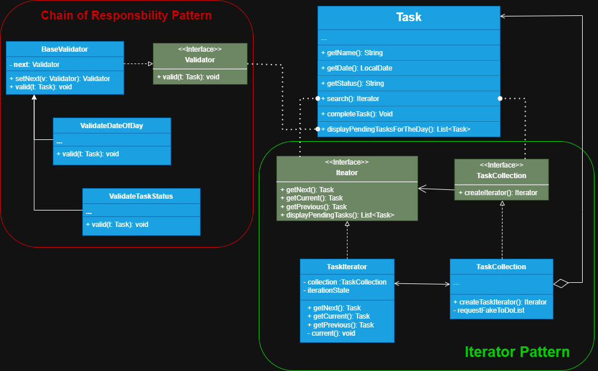

# Lista de tarefas passo 02

Neste projeto recriamos o que haviamos feito no primeiro passo, uma lista de tarefas simples que usa
o pattern iterator, onde utilizamos uma clase de dominimo chamada Task, ela representa a únidade da nossa
collection e através da interface collection e a sua classe concreta montamos a collection, e retornamos
a interface **Iterator** que implementa o nosso TaskIterator (classe concreta do iterador), onde deixamos a lógica
de iteração da collection. Porém, adicionamos outro pattern para nos ajudar com as validações e buscar
todas as tarefas que ainda temos pendente chamado **Chain Of Responsibility**.

> **Nota:** Este projeto teve como objetivo o aprendizado escalonado, visando sempre relembrar o que
> foi estudado de patterns anteriores e reconhecer quando utilizar cada pattern sempre levando em
> consideração o seu conceito.