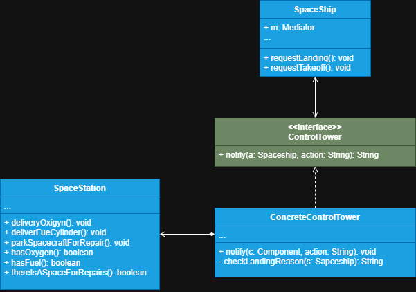

# Controle de tráfego espacial 

Este sistema simularemos um centro de controle espacial, onde lidaremos com as requisições de decolagem e pouso na estação espacial. 

# Explicação

**1 - Components:** São várias classes que contém a lógica de negócio, no nosso exemplo ela seria a (SpaceShip). Cada componente
deve conter uma referência ao mediador que ela notificará sendo ela uma interface do mediador, com isso 
os nossos componentes ficam desacoplados do mediador concreto, então o nosso componente não sabe exatamente quem é o mediador
apenas que deve realizar a notificação. Com isso podemos reutilizar o código do componente em sistemas diferentes e ligá-lo
a um mediador diferente.

**2 - Interface do mediador:** Declara métodos que devem ser implementados em mediadores concretos, estes métodos (geralmente apenas um)
visa definir a comunicação com os componentes. Componentes podem passar qualquer contexto para o método, até mesmo os seus próprios
objetos para serem manipulados, mas deve se atentar para que ao passar os parâmetros o remetente não pode conhecer o seu 
destinatário e vice-versa.

**3 - mediador concreto:** Nele que haverá o encapsulamento das relações entre os seus componentes, mediadores concretos quase
sempre matém referência a seus componentes concretos dos quais ele gerencia e algumas vezes até gerencia o ciclo de vida deles.

>**Nota:** Componentes não devem se conhecer e nem se comunicarem diretamente, caso aconteça algo importante no componente o mesmo deverá
> notificar o mediador para que ele tome as ações necessárias, seja tratando e gerenciando componentes na sua prórpia classe
> ou acionando o componente responsável por lidar com a lógica. O mediador é preparado para que ele consiga identificar rapidamente
> o remetente.
> 
> Conceitualmente o mediador serve para encapsular a comunicação entre os objetos, assim abstraindo a dependencia um do outro