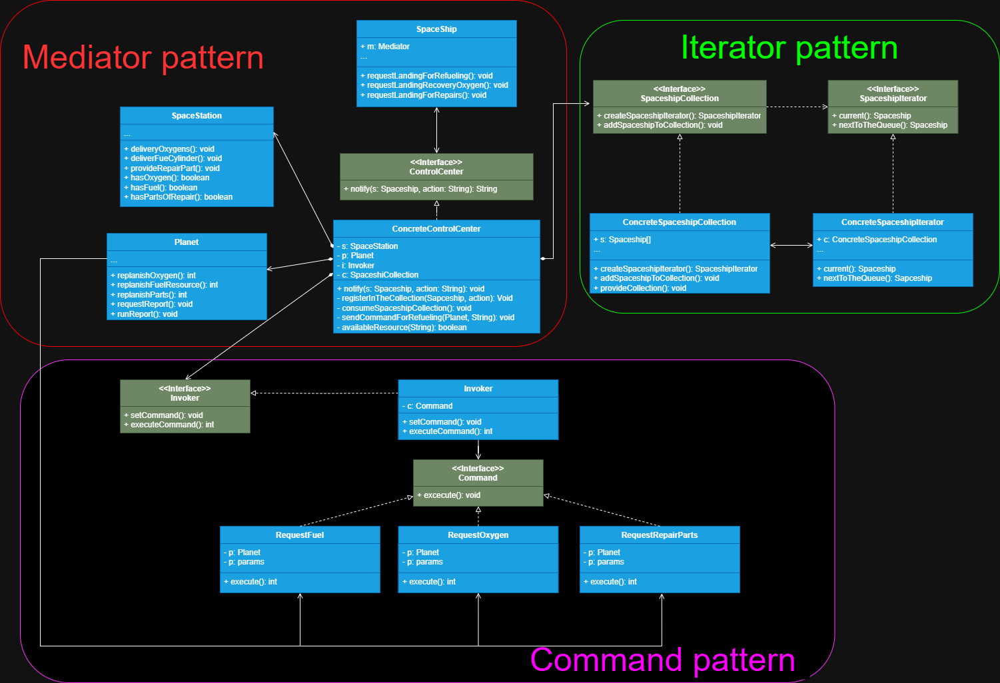

# Segunda versão do projeto de Controle de tráfego espacial 

Neste projeto continuamos com a ideia principal de tornar o centro de controle o mediador responsável
por lidar com todo o fluxo de solicitações de pouso e recarga de recursos, porém foram adicionados dois
padrões de projetos que já foram estudados anteriormente para podermos relembrar as suas estruturas e os seus
conceitos.

# Explicação

Primeiro implementamos o padrão **Mediator** que será responsável por encapsular toda a comunicação dos
seus componentes os gerenciando e agindo como um cérebro que orquestra todo o sistema, iniciamos criando
os nossos componentes Spaceship, SpaceStation e Planet, depois criamos a interface do mediador com o método
para notificá-lo sobre a solicitação de comunicação do componente, após criarmos a interface iremos 
implementá-la numa classe concreta (sendo o mediador concreto), nele deverá conter os campos referencia 
a todos os componentes que ele gerencia, com isso ele saberá rapidamente o objeto que o solicitou e o
responderá. Nesta classe também irão possuir todos os métodos responsáveis pela gestão do fluxo do
sistema. Em resumo a classe mediadora visa encapsular a comunicação entre objetos os gerenciando e 
construindo um fluxo, fazendo com que ela conheça todos os envolvidos (componentes), mas nenhum componente
tem conhecimento do outro.

Segundo implementamos o padrão **Iterator** que permite iterar sobre uma coleção sem expor a sua 
representação estrutural. Começamos declarando a interface da coleção, nela declaramos dois métodos
um responsável por fornecer o seu iterador (esse método deverá fornecer a interface do iterator) 
e outro por adicionar novos itens a coleção, (normalmente a
interface da collection apenas declara o seu método para fornecer o seu iterador, mas aqui optamos por
declarar um método respónsavel por adicionar um item a collection que será fornecido pelo **Mediator**).
Logo após implementaremos esta interface a classe concreta dela, onde realmente iremos construir a nossa
collection e além dos métodos da interface implementamos mais um, capaz de fornecer a collection para
o seu iterador. No próximo passo criamos a interface do iterador com métodos que percorrem a collection,
note que o iterador deve conter um campo referencia para a sua collection concreta, pois ele deve saber
exatamente qual collection que irá manipular. Em resumo o iterator encapsula a maneira como uma 
collection é criada e iterada, assim o código cliente no nosso caso o mediator não sabe como é a 
estrutura da collection, apenas que ela deve adicionar algo a ela e dizer qual o próximo objeto que 
ele deverá gerenciar.

Terceiro implementamos o padrão **Command** que encapsula a solicitação de um objeto, permitindo transformar
essa solicitação num objeto manipulável, ou seja, é como se o caminho percorrido da solicitação torna-se
um objeto concreto, permitindo ser manipulável. Começamos criando a nossa interface invocadora (opcional, pois
aqui queremos manter o máximo de abstração possível dentre o mediator e outros padrões), nela declaramos 
os métodos responsáveis por setar um comando e executar o comando, ela irá guardar uma referência a um
**Command**, e então a implementaremos na nossa classe concreta e implementamos os seus métodos, então
podemos dizer que a classe invocadora é responsável por iniciar um comando.
 A interface command deve declarar um método de execução, onde todos os comandos concretos 
deveram implementar, porém, os comandos concretos não devem realizar o trabalho por conta
própria, mas sim passar para um objeto de lógica de negócio (no nosso caso **Planet**). Em resumo
o **Command pattern** apenas encapsula a solicitação contendo todas as informações necessárias, 
transformando-a num objeto manipulável, desacoplando
quem chama (classe invocadora) de quem é chamado (objeto de lógica).

# Fluxo do sistema 

Primeiro a Spaceship (Component) solicita pouso na SpaceStation (Componente de destino) através do
ControlCenter (Mediator). O mediator recebe esse pedido e verifica se o recurso que a Spaceship
necessita está disponível se estiver então adiciona a nave na coleção para pouso. Depois a ControlCenter
em outro método, consome essa collection que foi criada pela classe ConcreteSpaceshipCollection (classe
responsável por montar a collection), e pede para que ela forneça o seu iterador para saber qual a próxima
nave a pousar e então gerencia todo o processo de fornecimento do recurso necessário para nave atual.
 Caso contrário os recursos que a nave solicitou para pouso não estejam disponíveis na SpaceStation, 
então é realizado um comando para o planeta solicitando mais recursos, no
momento negando a solicitação da nave, enquanto o comando de mais recursos é feito ao planeta, e 
nestes comandos, irá conter todas as informações da solicitação e estas informações serão armazenadas
nos registros do planeta (como uma pequena auditoria), para que o planeta possa gerênciar os seus recursos
 e então após concluír o fornecimento a estação espacial, o ciclo se repete.

# Resumo didático 

Utilizamos o **Mediator** para encapsular toda a comunicação entre componente, formando um fluxo e
fazendo com que nenhum componente se conheça. 

Utilizamos o padrão **Iterator** para criar uma coleção de naves espaciais que solicitem pouso e 
formas de iterar sobre ela, sem expor a sua estrutura.

Utilizamos o padrão **Command** para encapsular a solicitação do centro de controle para o planeta, 
transformando essa solicitação (ou caminho) num objeto concreto, capaz de ser manipulável, armazenar
as informações do pedido e passar a chamada para um objeto de lógica de negócio.

>**Nota** 
> 
>As Interfaces **Invoker** e **SpaceshipCollection** podem ser tratadas como componentes do 
> **ConcreteControlCenter**, a única diferença é que abstraímos as suas classes concretas, assim desacoplando
> os padrões. 
> 
> Na interface **SpaceshipCollection** declaramos um segundo método que visa adicionar novas naves, 
> é geralmente declarado apenas métodos para fornecer o seu iterador. Importante dizer também que
> métodos relativos à alteração da estrutura da collection sempre devem ser declarados na classe (e interface
> se for necessário) da collection e não no iterator.
> 
> Note que o componente **Planet** do **ConcreteControlCenter**, também é tratado como o **receiver (ou 
> destinatário)** no padrão **Command**, o mediador fica responsável por decidir como e quando utilizar
> a interface **Invoker (ou remetente)**, qual comando concreto vai ser utilizado no momento e
> o destinatário que eles vão solicitar retorno, porém as classes comando devem saber de 
> antemão qual será a classe de destino.