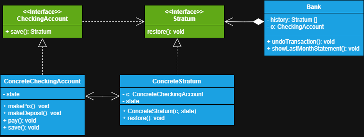

# Sistema de registros de transações bancárias

Neste projeto iremos criar um sistema que encapsula o estado atual de uma conta bancária, permitido ser
desfeita transações e, ao mesmo tempo, registrá-las. 

# Explicação

**1 - Interface CheckingAccount:** A interface checkingAccount declara um método para salvar o estado interno do
nosso objeto **Originator**, ou seja, o objeto que queremos salvar o estado para podermos restaurá-lo
depois, nela retornamos a interface **Stratum** o nosso **Memento**.

**2 - ConcreteCheckingAccount:** Classe originadora concreta, ou seja, é ele quem queremos salvar os seus estados, 
então implementamos a interface **CheckingAccount** a ela e implementamos o seu método de salvar instanciando e
retornando um **Stratum** (que no caso é o memento).

**3 - Interface Stratum:** Nesta interface temos o nosso **Memento**, onde declaramos um método capaz de 
restaurar o estado do nosso originador.

**4 - ConcreteStratum:** Classe concreta do nosso **Memento**, aqui é onde tudo acontece, pois é nela que
encapsularemos o estado atual do nosso objeto, devemos também definir um campo referencia ao originador concreto
para podermos utilizar os seus *setters* para restaurar o seu estado no método *restore()*.

**5 - Bank:** Por último, mas não menos importante temos a classe concreta **Bank**, ela é o que chamamos 
**cuidadora**, ou seja, ela fica responsável por armazenar e manipular *mementos*, podendo pedir ao memento
que restaure o estado do objeto ou que o originador salve seu estado naquele momento. Importante dizer que
a classe cuidadora não sabe nada sobre a implementação do objeto memento e originador, ela apenas lida com 
as suas *interfaces*.

>**Nota**
> 
> Existem várias formas de implementação deste padrão, sendo classes aninhadas ou apenas por uma interface
> intermediária. Mas escolhemos a opção com o encapsulamento mais restrito, onde ninguém tem acesso
> ao estado da classe originadora pelo seu Memento.
> 
> A classe Bank, apenas deve lidar com as interfaces de CheckingAccount e Stratum, não permitindo 
> ter acesso a suas classes concretas, não expondo a implementação da originadora.
> 
> A classe concreta originadora deve declarar *setters* para poder ser restaurada a seu estado pela 
> classe concreta do Memento. Apenas o memento tem acesso a estes *setters*.
> 
> Em resumo, a classe originadora deve fornecer o estado que queremos salvar e restaurar, o Memento
> é o retrato deste estado num momento específico, então podemos dizer que o Memento encapsula o estado
> atual num outro objeto e mantém estes dados no seu interior e a classe cuidadora mantém 
> um conjunto de mementos (lembranças), permitindo o seu salvamento e posteriormente a restauração do estado
> do objeto originador.