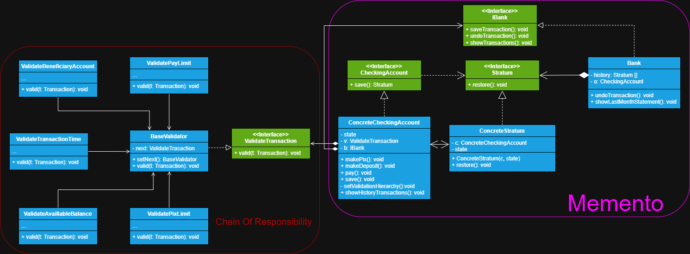

# Sistema de transação Bancária

Neste sistema alteramos um pouco a sua estrutura para poderem ser realizadas validações após uma 
transação na conta, caso a validação der errado, então restauramos a classe a seu último estado.

# Principais mudanças

## Memento Pattern

Temos como principal mudança a *interface* **IBank** que permite que o objeto originador possa ter acesso
à classe que controla o seu histórico de estados pela sua interface, podendo ele escolher quando salvar o seu estado e quando 
o restaurar, e com isso a classe **ConcreteCheckingAccount** deve manter referência ao *IBank* e passar
a sí mesmo para o objeto. Outro ponto
em que mudamos foi armazenar na nossa classe originadora uma referência a interface *ValidateTransaction* do 
padrão **Chain of Responsibility**, permitindo declarar um método para definir a hierarquia das validações.

## Chain of Responsibility

Aqui definimos outro padrão para poder realizar validações das transações que serão feitas na conta 
cada validação específica segue a sua classe pai **BaseValidator** que mantém a referência ao próximo
handler da cadeia, inclusive declara um método capaz de setar o próximo, e ela segue a sua *interface*
**ValidadeTransaction** que declara o método para a validação, e então definimos um método que haje
como o código cliente do padrão, chamado **setValidationHierarchy()** na classe **ConcreteCheckingAccount**
e com isso definimos a hierarquia da cadeia.

>**Nota**
> 
> Um sistema bancário deve validar todos os campos da transação para depois salvá-las no extrato da conta
> e concluí-las, porém para fins didáticos do padrão **Memento** resolvemos salvar antes, depois 
> realizar as validações com a **Chain of Responsibility** e deixar que, caso de algum erro com a validação
> o estado do originador seja restaurado para antes da ação.
> 
> Note que o padrão **Memento** está ligeiramente diferente em relação aos 3 modos que ele pode ser implementado, 
> pois a interface **IBank** que implementa a nossa classe cuidadora **Bank** serve para mantermos uma
> referência da classe na nossa *Originadora*, permitindo a originadora escolher quando salvar o seu estado.
> Os padrões servem apenas como base de códigos testados e aprovados, mas sua implementação pode variar
> conforme a necessidade do seu projeto, por isso é tão importante entender o seu conceito para definir quando,
> onde e de que modo utilizá-lo