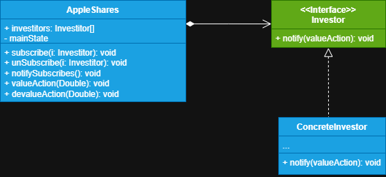

# Sistema de notificação de bolsa de valores

Neste sistema criaremos uma ação de uma empresa na qual investidores estão interessados, ela poderá valorizar e desvalorizar, cada
perfil de investidor fica responsável por lidar com essas mudanças individualmente.

**1 - Classe Observable (observada):** Começamos declarando qual a classe que queremos que seja observada, 
ela fica responsável por notificar os observadores caso haja algum comportamento de interesse 
ou modificação do seu estado. Ela possui uma infraestrutura que permite a novos 
observadores se inscrever ou desinscrever da lista de notificações, por isso ela deve armazenar um campo
referencia para uma lista da interface dos observadores. Quando um novo evento acontece, a classe sujeito
deve percorrer toda a lista de observadores e chamar o seu método de notificação declarado na interface
do observador em cada objeto observador.

**2 - Interface (observer):** A interface do observador declara um método para que todos que a implementar
seja notificado de eventos da classe observada, é geralmente declarado apenas um método para a notificação,
podendo ser passado parâmetros sobre a mudança de estado da classe observada, bem como ela mesma.

**3 - Observador Concreto (Concrete Observer):** Realizam ações em resposta as notificações enviadas pela classe sujeito,
todas devem implementar a mesma interface **Observer** para que a classe sujeito não fique acoplada aos seus
observadores

>**Nota**
> 
> É possível abstrair ainda mais a classe sujeito dos seus observadores criando uma classe especial, 
>capaz de ter na sua estrutura apenas métodos para inscrever, desinscrever e notificar observadores, 
>permitindo ter uma terceira classe que contenha todas as lógicas de negócio que ao mudar o seu estado ou ser
> ocasionado um evento ela possa chamar a classe sujeito pedindo que sejam notificados todos os seus
> observadores. 
> 
> Em resumo o padrão **Observer** visa encapsular a reatividade de componentes, ou seja, a partir do momento
> em que possuo uma classe sujeito e os seus observadores, qualquer alteração da classe sujeito gera uma
> cadeia de notificações aos observadores registradose podem reagir de modo independente, permitindo a propagação destes eventos em tempo
> real.                                                                                                                

