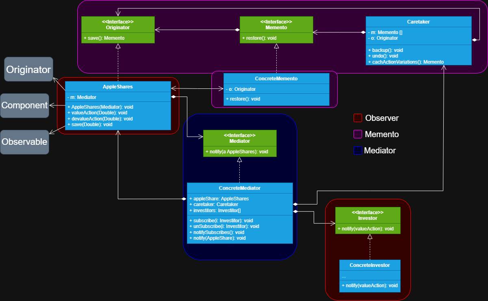

# Bolsa de valores 

Este projeto é a segunda etapa da primeira versão do projeto de bolsa de valores, onde apenas tinhamos 
utilizado o padrão de projeto **Observer** para que ao alterar o estado da classe **Observable**
(classe observada, no projeto *AppleShares*) e com esta
mudança gerar a notificação em tempo real a seus **Observers** (no projeto *Investor*), deixando com que 
cada um faça a sua ação. Porém, agora contamos com mais dois padrões o **Memento** que encapsula toda a
informação da classe *originadora* num *memento* e permite ao *caretaker* salvar estes mementos e 
pedir ao memento que restaure o originador ao seu último estado salvo. E por último, mas não menos importante
o padrão **Mediator** que encapsula a comunicação entre objetos diferentes sem que eles se conheçam, os forçando
a trabalharem juntos por um objeto mediador.

# Explicação por padrão

## Memento

Primeiro criamos o padrão **Memento**, permitindo salvar as alterações de estado do objeto originador, 
para isso definimos a *interface* do originador (objeto que queremos salvar e restaurar) que declara um 
método para salvar o estado do objeto e retornar a interface do **Memento**, depois criamos a *interface memento* que declara um método para que 
o *memento* possa restaurar o objeto originador (apenas o memento pode restaurar o seu originador, pois é
ele quem possui os detalhes do estado da classe), com isso criamos as suas classes concretas *tanto a do
objeto originador quanto a do memento*, a classe concreta do memento deve conter uma referência ao seu 
objeto originador para poder restaurá-lo, todavia a classe concreta do originador deve retornar uma instância
do memento no método *salvar*, passando o seu próprio objeto e demais parâmetros para salvar e por úlltimo
definimos a classe **Caretaker** que deve conter suas referencias em seu interior sendo uma lista da 
interface *memento*, então seria uma lista de mementos e outra a interface do objeto originador, com isso 
declarando métodos para fazer o backup (utilizando o *save* do originador), undo (para desfazer a última alteração
e restaurando o estado do objeto com o método *restore* do memento)e catchActionVariations para pegar os 
mementos.

## Observer

Depois criamos o padrão **Observer** a estrela do projeto, definindo um relacionamento um-para-muitos, ou seja,
a partir do momento que a nossa classe observada sofre algum evento ou alteração de estado todos os objetos
que estão a observando serão notificados, permitindo a propagação dessas mudanças em tempo real, então temos 
o nosso objeto **Observable** (que será observado), nele declaramos métodos para inscrever, desinscrever e 
notificar os objetos que são seus **Observers** (observadores), depois criamos uma *interface* que contém
a assinatura de um método para notificar os observadores, todos os *observers* devem seguir uma mesma interface
e implementar o seu método, para poderem ser chamados assim que alguma alteração a classe observada ocorrer e
por último temos os **Observers** concretos, que implementam o método da *interface observer* e cada
classe observadora define como se comportar mediante a alteração da classe observada.

## Mediator

Por último criamos o padrão **Mediator**, que visa encapsular a comunicação entre objetos que são chamados 
**Components**, com isso evitando o acoplamento entre eles e os forçando a trabalhar por um objeto
mediador. Começamos criando a classe **Component** (classes gerenciadas pelo objeto mediator), nela precisamos
armazenar uma referência a *interface do mediator* para podermos chamar o seu método. Depois declaramos
a interface do **Mediator**, aqui definimos o método para notificar os objetos que a implementarem (é geralmente 
passado o próprio objeto componente como parâmetro do método) e por fim criamos a classe concreta do mediator
e nela gerenciamos todos os seus componentes para que eles se comuniquem sem se conhecerem e criando o fluxo
da aplicação.

# Explicação geral do projeto

Com o padrão **Memento** salvamos cada alteração sobre o estado das ações da empresa **AppleShares** 
(se valoriza ou desvaloriza) e a armazenamos em **Caretaker** para restaurá-la ou apenas manter um histórico, 
depois utilizamos o **Observer** para notificar alterações no estado das ações para os investidores
que estão interessados na empresa, e é permitido que eles se inscrevam e desisncrevam dela, e ao
notificá-los destas mudanças eles escolhem como lidar. Por último utilizamos o padrão **Mediator**
para realizar a comunicação entre o objeto observado **(Observable)** dos seus observadores **(Observers)**
e poder recuperar o histórico destas alterações, para que os *observes* possam tomar as suas decisões.

>**Nota**
> 
> Importante repararmos no diagrama que do lado esquerdo da classe **AppleShares** temos três blocos escritos
> *Originator*, *Component* e *Observable*, isso quer dizer que a classe está a servir como um objeto
> originador (do qual queremos salvar o seu estado a cada alteração), um objeto component (a classe que
> contém a lógica que queremos utilizar no fluxo do sistema, fazendo a se comunicar com outros) e um
> objeto observable (que será observada pelos observers).
> 
> Outra informação importante é que o padrão **Mediator** com o **Observer** é amplamente utilizado, porém,
> sem declarar a interface do mediator, por exemplo, existem projetos em que você tem a classe *observable*, 
> *EventManager* e os *Observes*, onde o observable fica focado apenas nas lógicas da aplicação, o
> eventManager em sí é uma classe especial mediadora, onde ela irá inscrever, desinscrever e notificar os observadores sobre 
> alguma alteração na classe de lógica, então ela apenas irá cuidar desta comunicação, justamente o que 
> o mediator faz. Aí vem a pergunta... Quem é a classe observable, **EventManager** ou **Classe de lógica**?
> Em suma **EventManager** pode ser encarada como a observada ou a mediadora, ambos estão corretos.
