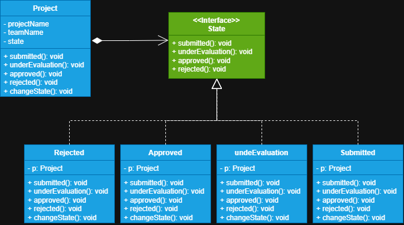

# Simulador de desafio Hackathon

Neste projeto iremos criar estados de um projeto feito por uma equipe de desenvolvedores, o seu
estado pode ser submetido, em avaliação, aprovado ou rejeitado.

# Explicação

**1 - Project:** Nossa classe de *contexto*. Aqui definimos a estrutura do contexto que iremos trabalhar no
projeto, após esta definição de estrutura devemos armazenar uma referência a *interface do estado* que nos
permitirá comunicarmos com os estados e delegar-lhes os seus trabalhos específicos, isso nos permitirá
alterar o comportamento do objeto contexto sem mexer na sua estrutura, apenas alterando o seu 
estado interno. Devemos declarar também um *setter* no contexto para podermos dar-lhe um objeto de
estado.

**2 - State:** A interface state declara métodos específicos aos estados. Estes métodos devem fazer sentido,
pois não queremos que as classes de estado concretas implementem métodos que nunca serão utilizados. Ela 
deverá implementar todos os estados que o contexto tiver.

**3 - Estados Concretos:** Fornecem a sua própria implementação para os métodos específicos de estado.
Objetos *estado* podem armazenar referências aos seus objetos de *contexto*, permitindo ao estado atual 
acessar informações sobre o seu objeto contexto, inclusive acessar o *setter* do contexto para poder 
realizar a transição para um próximo estado através do objeto contexto.

>**Nota**
> 
> Estados concretos podem realizar transições do estado atual para outro, uma vez que armazenam uma referência do seu contexto
> que permite utilizar o *setter* do objeto contexto, fazendo com que o contexto adquira um novo estado. Isto é
> particularmente útil quando um estado precisa (ou pode) realizar a transição para outro estado, no nosso exemplo
> **UnderEvaluation** pode transitar os estados do contexto para **ApprovedState ou RejectedState**, assim
> diminuindo também a necessidade de *IFs* no código.
> 
> Mas não é uma regra que estados façam a transição entre sí através do objeto contexto. Você pode simplesmente deixar
> essa transição com o código cliente. 
> 
> Outra coisa importante é que aqui acoplamos muito os nossos objetos, pois todos os estados se conhecem, 
>pois aqui precisamos deste acoplamento, mas pode ser que no seu projeto isso não seja necessário. 
> 
> Em resumo o padrão **State** permite a um objeto contexto mudar o seu comportamento através do seu estado
> interno sem alterar a sua estrutura, encapsulando lógicas específicas em objetos *estado*. Então quando o
> estado muda, o comportamento do objeto contexto também muda. Isso permite também objetos *estado* executarem 
> uma transição de estado no objeto contexto (opcional).
