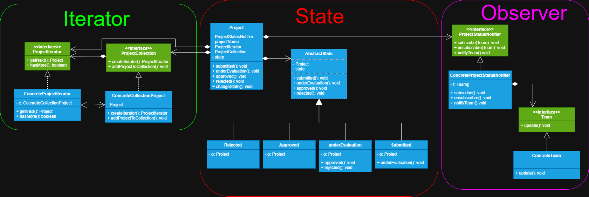

# Explicação

Este projeto é a segunda etapa do primeiro, onde simulamos os estados de um projeto desenvolvido por suas
equipes em um hackathon. Porém, aqui adicionamos alguns *patterns* como **Iterator** para adicionar
os projetos a uma coleção e iterar sobre eles para serem corrigidos, identificando qual o próximo para correção e 
se ainda há algum para ser corrigido. Depois, temos o **Observer** para notificar todos as equipes
interessadas sobre os estados atuais dos seus projetos.

# Explicação de implementação por *Design Pattern*

## Iterator

Começamos definindo qual será o objeto que compõe a coleção, no nosso caso é **Project**, depois declaramos
a *interface* da coleção responsável por declarar o método para fornecer o iterador compatível a ela, este método deve
retornar uma *interface* do iterador flexibilizando qual iterador será utilizado e então criamos a classe
concreta **ConcreteProjectCollection** para montar a coleção, implementamos a *interface* da coleção a classe
concreta, no método de criação do iterador na classe devemos retornar uma nova instância do seu iterador. Depois 
criamos a *interface* do iterador, declarando métodos para iterar sobre a coleção. Criamos a classe concreta
**ConcreteProjectIterator** para implementar a *interface* do iterator definido a implementação dos métodos.

## Observer

Começamos declarando a *interface* do notificador, para nós é a **ProjectStatusNotifier**, nela irá conter
todos os métodos de notificação, inscrição e desinscrição para as equipes. Então implementamos ela a nossa
classe concreta **ConcreteProjectStatusNotifier** que irá definir toda a lógica específica para notificar 
os seus assinantes, devemos também manter uma referência a *interface* do objeto observador para que o objeto 
observado possa se comunicar com os seus observadores através do seu método de notificação. *interface* do observador,
declara apenas um método para notificar objetos que a implementarem e por fim temos a nossa classe concreta
do observador que chamamos **ConcreteTeam**, nela devemos implementar a lógica do método de notificação.

## State

Começamos criando a classe do objeto que conterá diversos estados possibilitando mudar o seu comportamento 
através deles. No contexto do nosso projeto temos **Project** como objeto de contexto que possui vários estados
**Submitted**, **UnderEvaluation**, **Approved** e **Rejected**. O objeto de contexto deve manter uma referência
a um dos objetos de estado através da *interface* de estado, mas, no nosso projeto usaremos uma classe abstrata
que nos permitirá parametrizar métodos comuns aos estados concretos. Dentro da classe contexto definimos um
método *setter* para que estados possam passar novos estados ao contexto, provendo a transição entre estados.
Criamos a classe abstrata (pode ser *interface*) de estado que declara métodos específicos aos estados. E por fim
declaramos os nossos estados concretos que fornecem a sua implementação específica dos métodos. Eles podem
armazenar uma referência ao contexto, permitindo-o manipularem, e até através do método setter do contexto,
fornecerem novos estados para o contexto, podendo um estado executar a transição e estado no contexto.

>**Nota**
> 
> A classe **Project** esta servindo como a únidade que em conjunto, forma a coleção e armazena a referencia 
> as *interface*s da collection e do iterator para manter uma mesma instancia da collection. Utilizamos também
> a *interface* do notificador do observer em **Project** para que ao realizar a transição do estado, seja
> notificado os seus assinantes. 
> 
> Aqui utilizamos uma classe abstrata para parametrizar os métodos dos estados, assim possibilitando cada
> estado focarem nas suas implementações dos seus métodos de interesse.
> 
>Importante nos atentar para as transições de estado, pois devem fazer sentido, e estar de acordo com nossas
> regras de negócio da aplicação.

