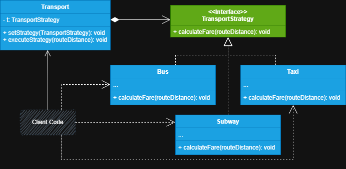

# Sistema de Calculo de tarifas de transporte

Neste projeto iremos calcular diferentes custos de transporte com base nas suas estratégias de precificação.

**1 - Classe de contexto:** No caso do nosso projeto, a classe de contexto é **Transport**, ela que mantém uma
referência a interface de estratégia, permitindo através desta interface a comunicação entre o contexto concreto e as estratégias
concretas.

**2 - Interface de estratégia:** Denominada como **TransportFare** no projeto, ela fica responsável por definir
o que é uma estratégia e declara um método que permite ao contexto executá-la, ela deve ser comum a todas as estratégias 
concretas.

**3 - Estratégias concretas:** Estratégias concretas são classes que implementam diferentes variações de um algoritmo
que o contexto usa.

>**Nota**
> 
> O contexto apenas chama o método que executa a estratégia. Claro, através dele é possível definir qual estratégia irá ser utilizada
> pelo seu método *setter*, mas isso fica a cargo do código cliente, pois ele escolhe através da condição qual será
> escolhida. A classe contexto não conhece nenhum detalhe sobre a estratégia que irá executar, ela apenas executa, tornando o código
> mais flexível e dacoplado, respeitando os princípios *OCP (Open closed principle) e S (Single responsibility principle)*
> do SLOID.

