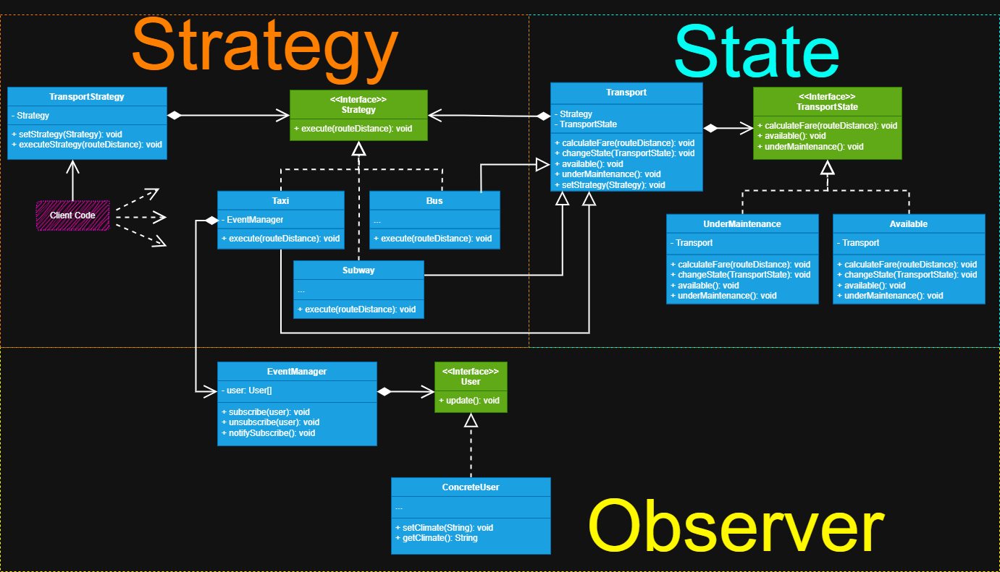

# Objetivo 

Aplicar o padrão de projeto **Strategy** em conjunto com outros padrões de projeto ja estudados, visando
o aprendizado escalonado. E aqui criamos a segunda etapa do projeto **Tarifas de transporte**.

## Padrões Utilizados

+ **Padrão principal:** *Strategy* 
+ **Outros padrões utilizados:** *Sate* e *Observer*

## Problema geral do Sistema

É preciso criar um sistema que seja possível escolher entre diversas formas de transporte conforme a sua
tarifa, porém o sistema deve apresentar dois estados para cada transporte, se ele está em manutenção ou
disponível, garantindo que o cálculo da tarifa só possa ser feito se o transporte estiver em estado 
disponível. Também é preciso notificar o utilizador do sistema, caso haja alguma 
alteração com a tarifa do transporte, por exemplo, a mudança do clima de sol para chuvoso pode implicar
num aumento da tarifa cobrada.

## Interação entre os Padrões

O *Strategy* foi utilizado para definir as diferentes formas de calcular a tarifa conforme o 
transporte escolhido, enquanto o *State* define os diferentes estados internos dos transportes, para
garantir que conforme o seu estado o transporte possa definir quando calcular a sua tarifa
e o Observer para notificar os utilizadores dos transportes caso haja alguma alteração 
na tarifa cobrada.

## Implementação no Projeto

Comecei utilizando o padrão *strategy*, onde crio um contrato através de uma *interface* e declaro um método
na qual as classes que a implementarem deverão fornecer a sua implementação pessoal, logo, a *interface*
define o que é uma estratégia e qual método deverá executar, depois criamos a diferentes formas de estratégias,
sendo elas as classes concretas que irão seguir o contrato implementando a *interface* *strategy* e definindo 
as suas diferentes formas de executar o algoritmo, depois criamos o contexto em que esta estratégia será
executada, sendo ela a classe **TransportStrategy** nela criamos métodos para setar uma estratégia e
executar a estratégia, e devemos armazenar internamente uma referência a *interface* **Strategy** no contexto
para permitir que o contexto de comunique com as diferentes estratégias através da *interface* **Strategy**.

Na segunda etapa do desenvolvimento comecei interpretando qual seria o contexto para o padrão *State*, pois
ele permite alterar o comportamento de uma classe conforme o seu estado interno muda, com esse conceito em mente
analisei e vi que os objetos que mudam de estado são os transportes, então defini uma classe **Transport**
que também podemos chamar de *contexto* neste caso, nela definiremos métodos comuns aos transportes, 
porém o contexto delega a execução destes métodos aos seus estados, pois no contexto é armazenado uma
referência a *interface* do estado que através dela é permitida a comunicação entre o contexto e as suas 
classes de estado concretas. Depois criei a *interface* **TransportState**, ela que fica responsável por 
definir os métodos específicos aos estados, estabelecendo o que é um estado e o que ele deve fazer conforme
o contexto, como um contrato que deverá ser seguido pelos seus estados concretos, a *interface* também
visa a comunicação entre o contexto e os seus objetos estados, sem que o contexto saiba qual estado 
ele está. E por último criamos os objetos de estado concreto **Available** e **UnderMaintenance** que 
implementam a *interface* de estado e fornecem as suas próprias implementações para os métodos específicos.
Na classe contexto também definimos um *setter*, para podermos passar-lhe um novo objeto de estado, os 
objetos estado contém uma referência ao contexto, pois assim podemos passar o próprio objeto de contexto
para o estado, permitindo através do estado manipular o contexto e pelo seu método *setter*, objetos estados podem
transitar entre sí, uma vez que podem utilizar o método *setter* do contexto e apenas passar um novo estado a ele. 

Por fim, mas, não menos importante, pensei em quais seriam os transportes que poderiam alterar a sua tarifa,
com isso em mente defini que apenas o **Taxi** pode realizar essa alteração. Precisava fazer com que 
ao alterar um objeto, isso pudesse refletir em outros (como uma notificação), ocasionando uma programação
reativa, que através da alteração de um objeto, outros que o observam devem manifestar as suas próprias reações, 
então conclui que deveria utilizar o padrão *Observer*. Comecei criando a classe **EventManager** que podemos
chamar *observable* ou objeto observado nele criei métodos para inscrever, desinscrever e notificar os
observadores também chamados *observers*, nesta classe é armazenado uma referência a uma coleção de *Observer*,
para que no método e de notificação o observable percorra a coleção de *Observer* chamando o método 
de notificação declarado na *interface* **Observer** de cada um dos assinantes. Depois criei a *interface* *Observer* 
que estabelece um contrato que diz o que é um *Observer*, e através da definição do seu método, o que um 
*Observer* deve fazer, por último criei o objeto concreto observador (ou *Observer*) que implementa a *interface*
*Observer* e realiza as ações quando ele percebe a alteração do observable e o seu método de notificação é chamado. 

## Benefícios de Usar Múltiplos Padrões

Ao utilizar estes padrões percebi que o sistema se tornou mais flexível extensível, pois ele segue
alguns dos princípios do **SOLID**, o primeiro *S* de *single responsibility principle* ou principio
da responsabilidade única, diz que se uma classe tem mais de um motivo para mudar, esta deve ser separada
para outras classes, e estas classes devam ter apenas um motivo para mudar. O segundo **O** de *open/closed principle*
ou principio do aberto/fechado, diz que uma classe deve estar aberta para extensão, mas fechada para modificação 
e o padrão *strategy* segue estes dois princípios, pois ele permite criar novas estratégias sem alterar
o contexto base, assim como cada estratégia possui apenas um único motivo para mudar, no *State* o princípio
open/closed também é seguido, pois podemos criar novos estados sem alterar o contexto base e outro benefício
deste padrão é evitar a necessidade de condicionais excessivas para definir o estado do objeto, ja que os objetos estado
podem transitar entre sí, através de métodos de classes correspondentes, e o *Observer* mais uma vez
também seguiu o open/closed, tornando assim um sistema altamente flexível.

## Aprendizado e reflexão

Aprendi que me atentar mais no conceito do padrão de projeto do que necessáriamente na sua implementação,
é mais benéfico para meu aprendizado, pois é através do conceito que posso saber quando, onde e de que 
maneira posso utilizá-lo no meu código. A minha principal dificuldade foi integrar os padrões *State* e *strategy*,
pois as estratégias em sí são as classes que contem mais de um estado, então pensei em como poderia fazer
essa relação de uma estratégia também ser um contexto que muda de estado e foi aí que criei a classe **Transport**
ela declara o objeto de contexto transporte e possui os seus estados internos, mas as estratégias firmam
uma relação de herança com a classe de transporte e, ao mesmo tempo, estratégias concretas implementam 
a *interface* *strategy*, logo, elas são um transporte e estratégia, isso permitiu-me através do estado 
do transporte declarar se é possível ou não executar o cálculo da tarifa da estratégia.