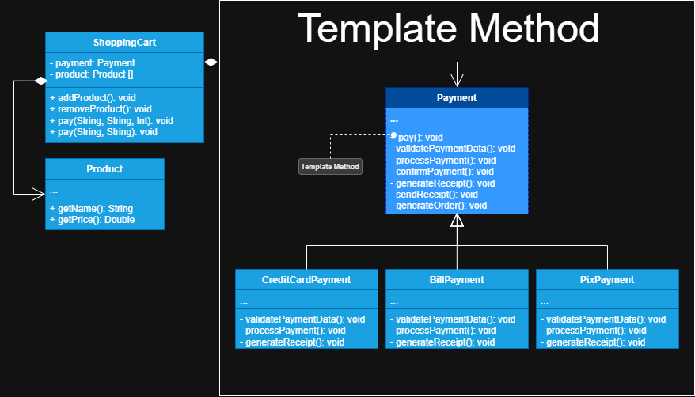

# Primeira etapa
**Objetivo:** Aplicar um único padrão de projeto para entender a sua funcionalidade e impacto no sistema.

## Padrão de Projeto
+ **Padrão Aplicado:** *TEMPLATE METHOD*
****
## Problema que o padrão resolve

Precisava fornecer diferentes formas de pagamento num sistema de checkout de loja virtual, 
porém as etapas que um pagamento precisa realizar são as mesmas, pensando nisso decidi utilizar o padrão de
projeto *template method*

## Contexto e Justificativa

Este padrão foi escolhido, pois permite que eu crie uma superclasse base que contenha um método modelo capaz de
fornecer uma estrutura do algoritmo comum a todas as formas de pagamento. E permite que as subclasses 
possam sobrescrever etapas específicas do método modelo, sem alterar a sua estrutura. 
****
## Implementação no Projeto

Implementei a classe abstrata **Payment** que contém o método modelo *pay()*, depois separei o algoritmo do 
método modelo em pequenas etapas sendo elas: *validatePaymentData()*, *processPayment()*, *confirmPayment()*,
*generateOrder()*, *generateReceipt()* e *sendReceipt()*, onde os métodos de *validatePaymentData()*, *processPayment()* e *generateReceipt()*
declarei como abstratos, fazendo com que as subclasses sejam forçadas a implementarem
estes métodos, pois cada pagamento tem estas etapas diferentes. Então criei as subclasses **CreditCardPayment**, 
**BillPayment** e **PixPayment** que estendem a classe abstrata **Payment** e nelas sobrescrevi as etapas
específicas para cada tipo de pagamento, porém não alterei a estrutura do método modelo.

****

## Resultado e Benefício

A lógica que seria duplicada para cada método de pagamento foi centralizada numa única classe, o que 
permitiu as classes específicas lidarem apenas com as suas etapas específicas, assim caso este 
sistema sofra alguma alteração no seu algoritmo modelo, não será necessário sair alterando todas as outras
classes, pois qualquer alteração neste método ja será refletido nas demais classes. Este padrão também
segue alguns dos princípios *SOLID*, como o *S* de *Single Responsibility Principle*, pois cada classe
foca nas suas respetivas responsábilidades e possui apenas um motivo para mudar, e *O* de *Open/Closed Principle*,
pois a classe abstrata **Payment**, esta aberta para extensão e fechada para modificação porque se quisermos
outros métodos de pagamento, apenas precisamos estender esta classe e implementar as etapas específicas, mas
não modificamos o método modelo.
***
## Aprendizado e Reflexão

Aprendi a reconhecer melhor os padrões dos algoritmos e como eles estão sendo utilizados em diferentes classes,
com isso consegui identificar repetições no código e como resolver estas duplicações de maneira que faça
sentido com o contexto das classes que estou lidando, tanto quanto separar
em etapas um algoritmo complexo, e nestas etapas identificar quais são específicas e quais são padrão para 
cada classe. Aprendi também a questão da manutenibiliade do sistema, pois ao centralizar uma lógica comum
a todas as classes permitindo que elas alterem apenas etapas específicas do processo, ao precisar dar 
manutenção no método modelo, é necessário alterar apenas um arquivo e isso irá refletir em todas as subclasses. O meu 
principal desafio foi entender como é o processo de pagamento, então precisei recorrer a estudos sobre isso
e de primeira instância implementei um código repetitivo para cada classe, para que com isso eu pudesse 
identificar padrões do algoritmo de pagamento como poderia desestruturar isso em etapas menores, em resumo
aprendi que primeiro devo apenas codificar a solução para que depois eu possa analisar e ver 
qual padrão se encaixa melhor e faz mais sentido, e analisar se é realmente necessário essa complexidade.

