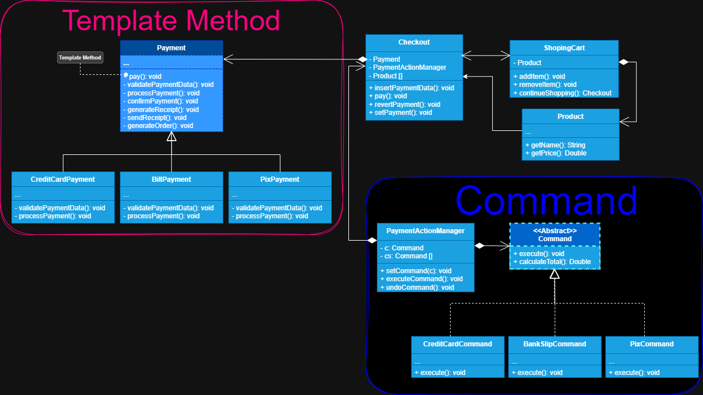

# Objetivo
Aplicar o padrão treinado em conjunto com outros padrões aprendidos, promovendo o aprendizado escalonado.

## Nome dos Padrões de Projeto Utilizados

+ **Padrão principal:** *TEMPLATE METHOD*
+  **Outros padrões:** *COMMAND*

## Problema Geral do Sistema

Precisei criar um sistema de checkout que suportasse diversas formas de pagamento, sendo elas cartão de crédito,
boleto bancário e pix. Porém, antes de tudo isso precisaria de uma forma que o cliente pudesse alterar a maneira do pagamento
antes de realizar realmente a compra, e com isso o checkout deveria apresentar as informações antes da compra como o total a ser pago
e como ia ser pago, assim também como taxas se aplicável.

## Interação Entre Os Padrões

 O *template method* (padrão principal do projeto) foi utilizado na maneira de processar e concluir o pagamento, com isso 
utilizei uma classe abstrata base **Payment**, também chamada *superclase* para definir a sequência deste processo e quebrei
em etapas para que as subclasses pudessem alterar as partes específicas do processamento conforme o seu contexto, mas para que
pudesse chegar nesta fase de conclusão e processamento do pagamento, primeiro utilizei o padrão *command* para encapsular
os dados do pedido de pagamento fornecidos pelo cliente de forma que pudesse antes de realizar a compra, retornar ao cliente
algumas informações sobre o seu pedido, subtotal, parcelas, etc. Isso permitiu também desfazer uma ação de escolha do pagamento.

## Implementação no Projeto

+ ### Template Method 
    Primeiro criei a classe abstrata chamada **Payment** que contém o método modelo *pay()*, que faz todo o processo de pagamento, 
porém o dividi em várias etapas. Algumas etapas do método modelo foram sobrescritas em cada subclasse que herdou de **Payment** sendo elas 
**CreditCardPayment**, **BillPayment** e **PixPayment**, ou seja, defini um método modelo na superclasse contendo todo o 
processo de pagamento, mas permiti que as subclasses pudessem alterar etapas específicas do algoritmo conforme o seu contexto.

+ ### Command
    Primeiro criei a classe abstrata **Command** (normalmente são interfaces, mas para o contexto do projeto foi utilizado a classe abstrata), 
ou seja, ela quem define o que são comandos e declara um método para serem executados, logo ela deve extender todos os comandos, 
depois criei a classe invocadora que chamei **PaymentActionManager**, ela fica responsável por setar o comando e executar o comando
através do método fornecido pela classe abstrata **Command**, mas foi preciso manter uma referência a classe comando abstrata, pois
isto que possibilita a comunicação entre a classe invocadora e os comandos concretos, fazendo com que a classe invocadora 
não fique acoplada aos comandos concretos e sim ao contrato definido para eles seguirem, e aqui chegamos ao motivo de preferir uma 
classe abstrata ao invés de uma interface para definir o comando, foi para poder utilizar o método *calculateTotal()* em todos
os comandos concretos que herdem do comando abstrato, possibilitando a formatação da informação que será passada ao pagamento.
E por último criei as classes comando concretas, onde elas herdam da classe comando abstrata e implementam o método de comunicação
*execute()* de maneira a fornecer sua própria implementação do método, ou seja, o command foi utilizado para encapsular 
o caminho entre o checkout e o pagamento, possibilitando a manipulação das informações antes de chegarem ao destinatário e mantendo
um breve registro para que possam ser desfeitos.
 > Nota: Mantive também uma referência a classe abstrata de *Command* em forma de array, para poder colocá-lo numa lista e manter
> histórico de comandos utilizado, mas pode ser criado uma classe externa para manter este controle.

## Benefícios de Usar múltiplos Padrões 

O Maior benefício em utilizar estes padrões foi a capacidade que o sistema tem de poder ser extensível sem modificar o
código já existente, mas existem outros benefícios como manter cada responsabilidade numa única classe, minimizando a quebra de outras
estruturas caso haja manutenção num ponto específico do sistema.

## Aprendizado e Reflexão

A maior reflexão foi que aprendi foi para não programar pensando num padrão, apenas resolva o problema e depois naturalmente o padrão se encaixará na
solução, pois as vezes é necessário e as vezes desnecessário causando uma overengineering.