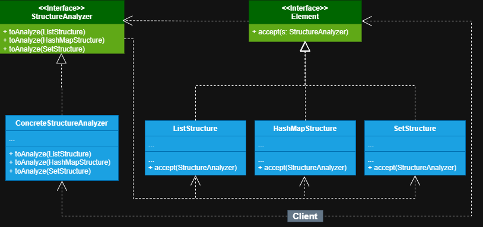

## Nome do Padrão de Projeto
+ **Padrão Aplicado:** *VISITOR*

## Problema que o Padrão Resolve

+ Neste sistema precisava analisar diferentes coleções de dados armazenados em diferentes estruturas, para entender melhor
como os dados estão organizados e se existem padrões, anomalias ou redundâncias, com isso em mente utilizei o padrão *visitor*.

## Contexto e Justificativa

Escolhi o *visitor* porque ele me permite certa modularidade sob a lógica que será aplicada a um objeto, uma vez que ele separa
o algoritmo do objeto que ele opera, mantém as classes focadas numa única responsábilidade e me permite estender o sistema
com novas classes de análise.

## Implementação no Projeto

Comecei implementando a *interface* **StructureAnalyzer** que declara os métodos visitantes que podem conter como
argumento classes concretas, ela que define o contrato sob o que são classes visitantes e o que devem seguir e claro
ela deve implementar todas as classes visitantes concretas, logos após criei a classe visitante concreta 
**ConcreteStructureAnalyzer**, ela quem realmente vai conter toda a implementação da lógica das análises, porém contento
o mesmo comportamento sob o contexto que no nosso caso é *analisar* de diferentes maneiras conforme 
a classe que o executar. Depois criei a *interface* **Element** que declara um método para aceitar visitantes, nela
declarei como parâmetro do método o tipo da *interface* do visitante para que o algoritmo do visitante possa
ser executado pela classe que implementar a *interface Element*. Por último criei as classes concretas das 
estruturas a serem analisadas sendo **ListStructure**, **HashMapStructure** e **SetStructure**. Elas 
implementam a *interface* *Element* e sobrescrevem o método de aceitação, cuja função é de redirecionar a chamada
para o método visitante apropriado que corresponde a atual classe elemento.

## Resultado e Benefícios

Com este padrão consegui manter cada classe com a sua responsabilidade, o que facilita na hora de realizar
manutenções no sistema, o sistema ficou bem flexível, me permitindo conter diversas formas de análise e claro
de expandir cada vez mais sem alterar as classes de estruturas concretas, apenas criando novas classes visitantes
que implementem a interface do visitante. 

## Aprendizado e Reflexão

O meu maior aprendizado com este padrão foi em como posso tornar o sistema mais flexível e modular, uma vez
que esta separação segue dois dos *princípios SOLID* (*Single responsibility principle* e *Open/Closed principle*)