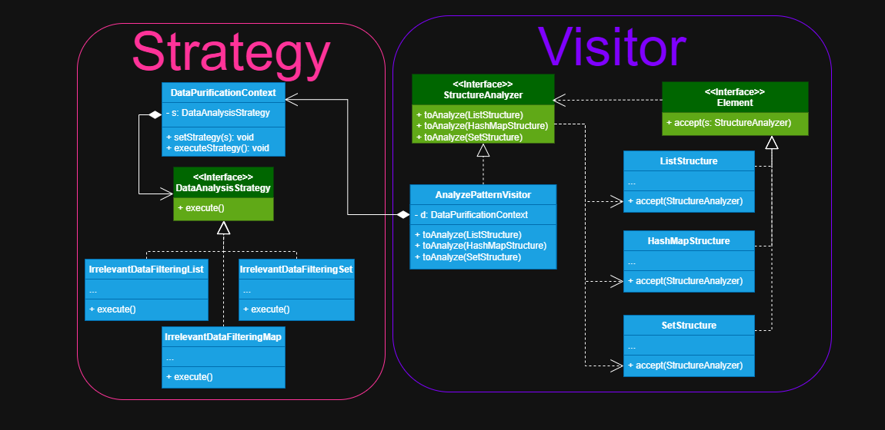

## Nome dos Padrões de Projeto Utilizados
- **Padrão principal treinado:** *VISITOR*
- **Outros padrões:** *STRATEGY*

## Problema Geral do Sistema

Precisei criar um sistema que compreendesse diversas estruturas de dados para análise, e que limpasse os dados
conforme a sua estrutura para analisar apenas dados que contém valores aceitáveis.

## Interação entre os Padrões

O *Visitor* foi utilizado para separar a lógica de análise dos dados das classes de estrutura, enquanto 
o *Strategy* foi utilizado pelo *Visitor* para limpar os dados conforme a estrutura atual.

## Implementação no Projeto

### Visitor

Comecei criando a interface de **StructureAnalyzer** (a nossa interface do visitante), declarando 
um conjunto de métodos para análise, neles contém diversas estruturas de objetos como argumento, depois criei a classe
do visitante concreto sendo **AnalyzePatternVisitor** responsável por conter toda a lógica das análises, fornecendo
diferentes implementações dos métodos da interface do visitante que a implementa conforme o elemento que ela recebe como
argumento. Depois criei a interface **Element**, onde declarei um método para aceitar a interface do visitante, este
método será responsável por aceitar uma classe visitante que implementar a interface do mesmo 
e permitir aos elementos concretos o executar, por último criei os elementos concretos sendo 
**ListStructure**, **HashMapStructure** e **SetStructure** que implementam a interface elemento e 
definem uma implementação do método de aceitação da interface do elemento, cuja função será de redirecionar
a chamada para um método visitante apropriado que corresponda a classe atual.

### Strategy

Primeiro criei a interface de estratégia **DataAnalysisStrategy** declarando um método para executar a estratégia ,
ela que irá implementar todas as estratégias concretas, pois ela que define este contrato sob o que é uma estratégia,
depois criei as estratégias concretas **IrrelevantDataFilteringList**, **IrrelevantDataFilteringMap** e 
**IrrelevantDataFilteringSet**, elas quem irão implementar a interface estratégia e conter as lógicas para filtrar dados irrelevantes conforme 
as estruturas que estão sendo analisadas. Por último defini a classe contexto **DataPurificationContext** 
ela fica responsável por setar uma estratégia conforme o contexto atual e pedir que execute
e tudo isso, pois ela mantém uma referência de agregação a interface de estratégia, permitindo que ela possa receber
qualquer classe concreta que implementar a interface estratégia.

## Benefícios de Usar Múltiplos Padrões

A lógica de análise fica separada da estrutura concreta, o que possibilita criar novas analises para as
estruturas sem modificá-las, o mesmo ocorre com a limpeza de dados feita por estratégia, produzindo um 
sistema modular e extensível.

## Aprendizado e Reflexão

Aprendi que o *Visitor* e *Strategy* são bem próximos quando o quesito é separar responsabilidade e executar
lógica em classes separadas do domínio do sistema, o que os tornam meio-complicados de serem implementados
juntos por esta proximidade conceitual, então o que aprendi foi a pensar mais no contexto do sistema do
que no padrão em sí, e isso me permite enxergar a necessidade de utilizar ou não determinado padrão de projeto.