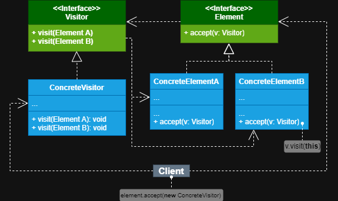

# *Visitor*
***

### Definição e Conceito 
+  Este padrão faz com que você possa separar objetos dos algoritmos que os operam, separando então os algoritmos
que executam a lógica para outra classe, mas permitindo que manipulem os seus objetos alvo.

### Benefícios e Propósito
+  Este padrão visa tornar o sistema flexível e escalável, capaz de integrar diversos algoritmos a diversas classes
sem que sejam alteradas a cada nova operação fornecida, o que facilita a manutenção do 
sistema, segue os princípios **SOLID** como, *S* de *Single Responsibility Principle* (principio da 
responsabilidade única), onde cada classe tem apenas um único motivo para mudar e *O* de *Open/Closed Principle*
(princípio do aberto/fechado), onde é possível criar novos comportamentos a diferentes objetos sem alterar as 
suas classes.

### Analogia do Mundo Real
+   Imagine um piloto de corrida capaz de pilotar em diversas pistas e tipos de corrida. Ele pode correr 
em todas as pistas da qual ele foi chamado. Dependendo de qual o tipo da corrida e pista, ele pode escolher
um veículo especializado para cada uma. Se for uma corrida de fórmula 1, então escolhe um carro de fórmula 1.
Se for uma corrida de NASCAR então escolhe um carro stock. Se for uma corrida de turismo, então escolher um carro
de produção altamente modificado.

### Estrutura do padrão

| **Componente**     | **Comportamento**                                                                                                                                                                           |
|--------------------|---------------------------------------------------------------------------------------------------------------------------------------------------------------------------------------------|
| Interface Visitor  | Declara um conjunto de métodos visitantes que podem receber diversos elementos concretos para cada método                                                                                   |
| Visitante Concreto | Implementa diferentes versões do mesmo comportamento, específicos de acordo com o objeto concreto passado por parâmetro                                                                     |
| Interface Element  | Declara um método para aceitar visitantes, onde a interface do visitante deve ser passada como parâmetro, permitindo a ele que possa executar seu algoritmo                                 |
| Elemento Concreto  | Cada elemento concreto deverá implementar a interface *Element* e seu método de aceitação, que deverá redirecionar a chamada para o método visitante correspondente a classe que o executou |

## Quando Usar Este Padrão

+ Quando se deparar com uma classe complexa e poluída com lógicas de négocio e lógica auxiliares, pois assim você
pode separar e manter as suas classes focadas nas suas lógicas principais e extrai todos os outros comportamentos 
em classes visitantes. Utilize quando precisar executar uma operação em diversas outras classes de um conjunto de classes
